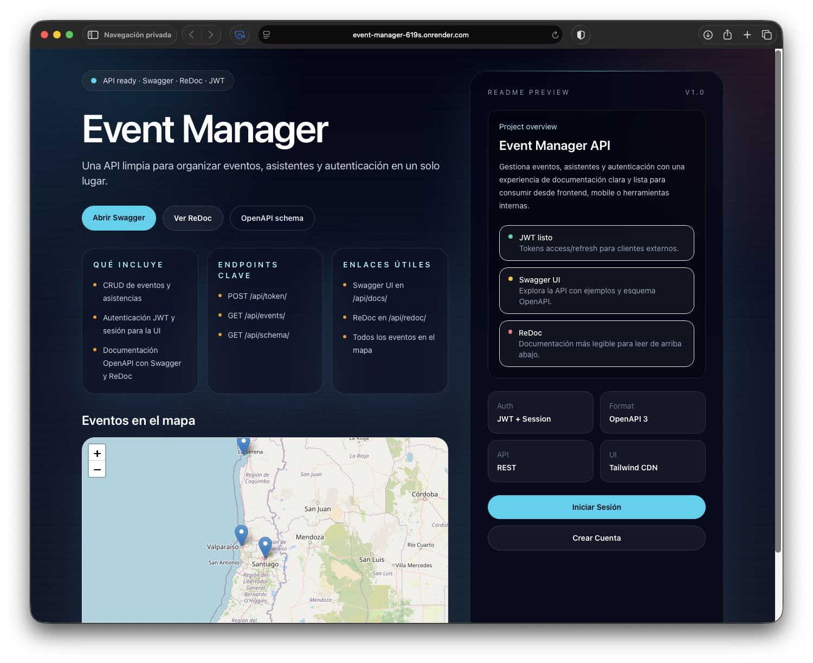
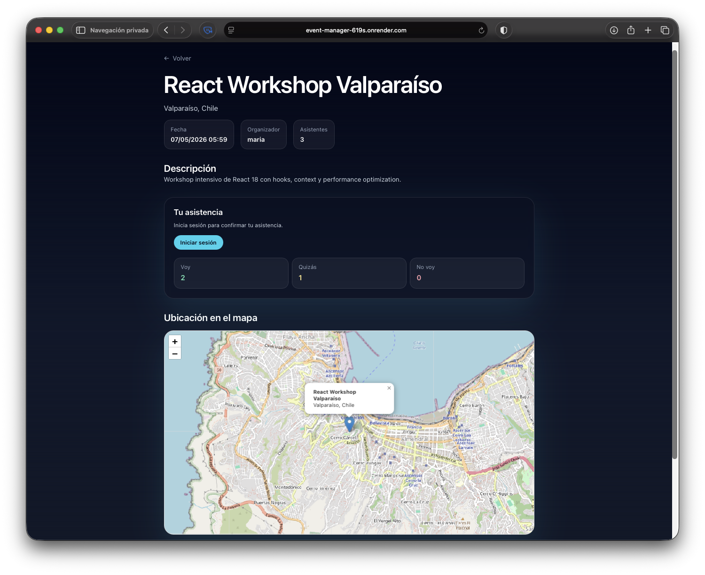
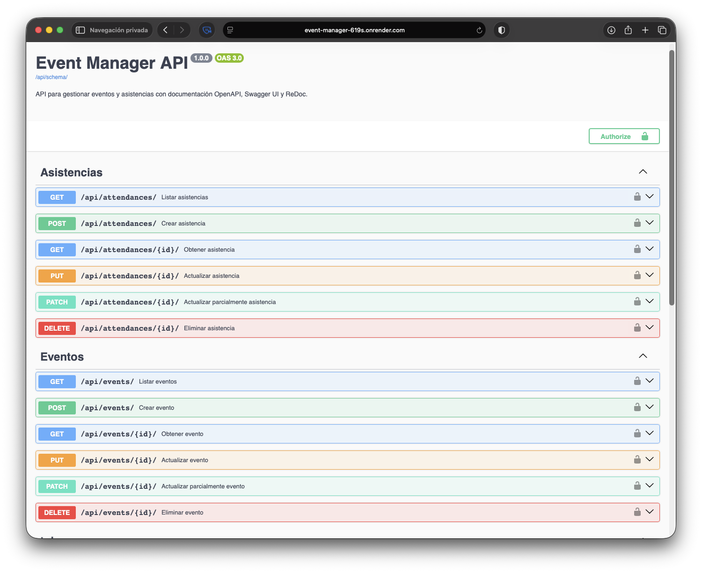

# Event Manager

Aplicación full-stack para crear, descubrir y gestionar eventos geolocalizados en Chile, con autenticación segura y visualización en mapas interactivos.

## 🚀 Demo en producción

👉 https://event-manager-619s.onrender.com

- Portada pública con mapa: `/`
- Dashboard autenticado: `/` (cuando inicias sesión)
- Crear evento desde UI: `/event/create/`
- Detalle de evento + RSVP: `/event/<uuid>/`
- Swagger UI: `/api/docs/`
- ReDoc: `/api/redoc/`

## ✨ ¿Qué lo hace interesante?

- Eventos geolocalizados visualizados en mapa interactivo.
- Autenticación dual: sesión + JWT para API.
- Arquitectura híbrida: server-rendered + API REST.
- Permisos por rol con control de acceso real.

## Capturas





## 🛠️ Stack técnico

**Backend**
- Django
- Django REST Framework

**Frontend**
- Django Templates
- Tailwind (CDN)
- Leaflet + OpenStreetMap

**Infraestructura**
- Render (deploy)
- GitHub Actions (CI)

**Auth**
- Session Auth
- JWT (`djangorestframework-simplejwt`)

**Base de datos**
- SQLite (desarrollo)

## Funcionalidades clave

- CRUD de eventos y asistencias vía API REST.
- UI con mapa público de eventos georreferenciados en Chile.
- Registro/login/logout de usuarios.
- Dashboard con eventos creados y asistencias del usuario.
- RSVP desde la vista de detalle (`Voy`, `Quizás`, `No voy`).
- Permisos por rol:
	- Admin: acceso total.
	- Usuario: solo sus propios recursos para edición/gestión.

## Endpoints principales

- `GET/POST /api/events/`
- `GET/PATCH/PUT/DELETE /api/events/<uuid>/`
- `GET/POST /api/attendances/`
- `GET/PATCH/PUT/DELETE /api/attendances/<id>/`
- `GET /api/events/public/`
- `POST /api/token/`
- `POST /api/token/refresh/`
- `POST /api/token/verify/`

## Arquitectura (resumen)

- `events/models.py`: `Event` y `Attendance`.
- `events/views.py`: ViewSets DRF con permisos por rol.
- `config/views.py`: vistas HTML (home, auth, crear/editar evento, RSVP).
- `templates/`: UI server-rendered.
- `.github/workflows/ci.yml`: pipeline de validación.

## Ejecutar en local

1. Crear entorno virtual e instalar dependencias:

```bash
python3 -m venv .venv
source .venv/bin/activate
pip install -r requirements.txt
```

2. Migrar y poblar datos de demo:

```bash
python manage.py migrate
python manage.py populate_db
```

3. Levantar servidor:

```bash
python manage.py runserver 8000
```

4. Abrir en navegador:

- `http://127.0.0.1:8000/`

## Credenciales de prueba

- Admin: `admin / admin123456`
- Usuario: `juan / juan123456`
- Usuario: `maria / maria123456`
- Usuario: `carlos / carlos123456`

## Calidad y validación

- Validación local:

```bash
python manage.py check
python manage.py test
```

- CI automático en cada PR/push a `main`:
	- install dependencies
	- `check`
	- `migrate`
	- `test`


